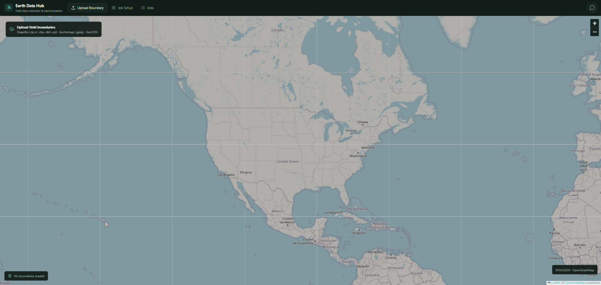
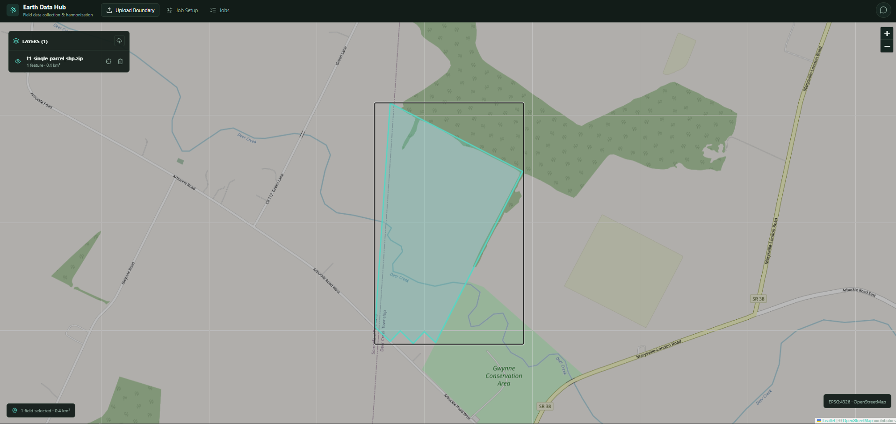
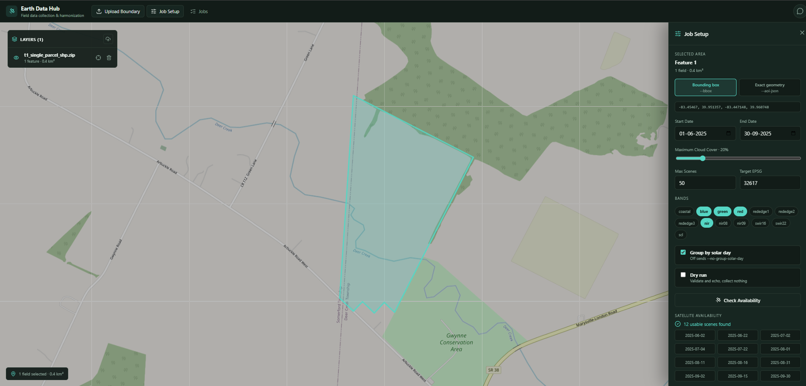
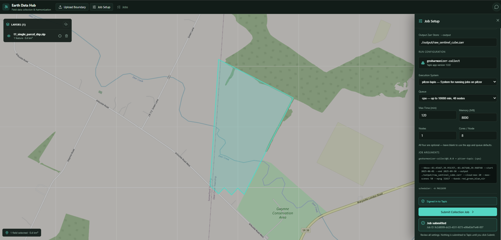
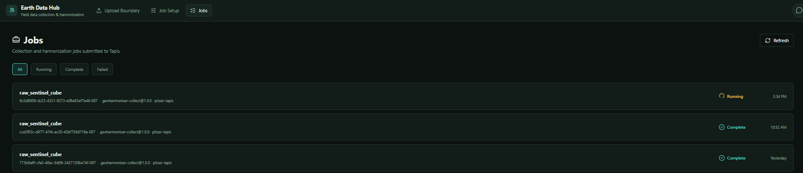

# Earth Data Hub

A browser-based geospatial data discovery and collection interface for selecting an area of interest, checking satellite scene availability, configuring collection parameters, and submitting GeoHarmonizer collection jobs to HPC resources through Tapis.

**Tags:** CI4AI, Geospatial, Earth-Observation, Visual-Analytics, Software

### License

BSD 3-Clause License

## References

- [Tapis Jobs API](https://tapis-project.github.io/live-docs/?service=Jobs) — HPC job submission and monitoring.
- [GeoHarmonizer](https://github.com/OSU-SAI-Lab/geoharmonizer) — backend collection and harmonization workflows.
- [Earth Data Hub UI](https://github.com/ICICLE-ai/geoharmonizer-ui) — frontend application.

## Acknowledgements

*National Science Foundation (NSF) funded AI institute for Intelligent Cyberinfrastructure with Computational Learning in the Environment (ICICLE) (OAC 2112606).*

## Issue Reporting

Please report issues through the [GitHub Issues](https://github.com/ICICLE-ai/geoharmonizer-ui/issues) page.

---

# Tutorials

## Open Earth Data Hub

Open the Earth Data Hub interface.



The main interface provides access to the interactive map, boundary upload, Job Setup, and Jobs monitoring.

## Upload and Select an Area of Interest

Click **Upload Boundary** and upload a supported geospatial boundary file.



After the boundary is loaded:

1. The uploaded boundary appears on the map.
2. Select the field or polygon you want to use.
3. The selected area becomes the Area of Interest (AOI).

Earth Data Hub supports two AOI options:

- **Bounding box** — uses the geographic extent of the selected area.
- **Exact geometry** — uses the complete selected geometry.

The selected AOI is used for satellite availability checking and collection job submission.

## Configure Satellite Collection

Open **Job Setup** after selecting an AOI.

Configure the collection settings based on the satellite imagery you want to retrieve.

## Check Satellite Availability

Click **Check Availability** after configuring the collection.



Earth Data Hub displays the number of usable satellite scenes and their acquisition dates.

Review the availability results before submitting the collection job.

## Configure the Tapis Job

A valid Tapis session is required for job submission.

If an active Tapis session is available, Earth Data Hub recognizes it and loads the available execution systems and queues.

Configure the execution settings and review the generated GeoHarmonizer job arguments before submitting.



## Submit the Collection Job

Click **Submit Collection Job**.

After Tapis accepts the request, Earth Data Hub displays a submission confirmation and Job ID.

The submitted job can then be monitored from the **Jobs** page.

## Monitor the Job

Open the **Jobs** page to view submitted GeoHarmonizer collection jobs.



The Jobs page shows the current status of submitted jobs. Use the available filters and **Refresh** to retrieve the latest information.

---

# How-To Guides

## Run Earth Data Hub Locally

Install the frontend dependencies:

```bash
npm install
```

Start the development server:

```bash
npm run dev
```

Build the production frontend:

```bash
npm run build
```

## Run with Docker

Build the Earth Data Hub frontend image:

```bash
docker build -t earth-data-hub-ui:latest .
```

Run the container:

```bash
docker run --rm -p 8080:80 earth-data-hub-ui:latest
```
---

# Explanation

## Area of Interest

The Area of Interest (AOI) defines the geographic region used for satellite data discovery and collection.

Earth Data Hub allows users to upload geospatial boundaries and select a field or polygon from the interactive map.

The selected AOI can be represented as either a bounding box or exact geometry.

## Satellite Availability

Before submitting a collection job, Earth Data Hub can check whether satellite imagery is available for the selected AOI and collection settings.

```text
Earth Data Hub
      │
      ▼
GeoHarmonizer Availability Service
      │
      ▼
Earth Search STAC
```

The available scenes are returned to Earth Data Hub and displayed to the user before job submission.

## Tapis Collection Workflow

Earth Data Hub converts the selected AOI and collection configuration into a GeoHarmonizer collection job and submits it through Tapis.

```text
Earth Data Hub
      │
      ▼
Tapis Jobs API
      │
      ▼
HPC Execution System
      │
      ▼
geoharmonizer-collect
```

After submission, the job can be monitored from the **Jobs** page until the collection workflow completes.